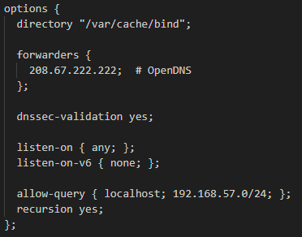
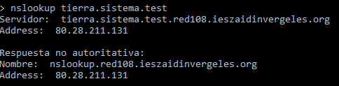

# Proyecto: Configuración de Servidor DNS Maestro-Esclavo

Este proyecto consiste en la configuración de un sistema DNS maestro-esclavo utilizando **BIND9** y **Vagrant**. La red está configurada con dos servidores: **tierra.sistema.test** (maestro) y **venus.sistema.test** (esclavo).

## Contenido

- [Requisitos previos](#requisitos-previos)
- [Infraestructura del Proyecto](#infraestructura-del-proyecto)
- [Pasos Realizados](#pasos-realizados)
- [Configuración de Servidores](#configuración-de-servidores)
- [Comprobación Final](#comprobación-final)
- [Comprobación Test.bat](#comprobación-test.bat)
- [Licencia](#licencia)

---

## Requisitos previos

- **Vagrant** instalado.
- **VirtualBox** instalado.
- Acceso a internet para descargar las imágenes de Debian.

---

## Infraestructura del Proyecto

Este proyecto está compuesto por 2 máquinas virtuales en una red privada (192.168.57.0/24):

| Máquina                | FQDN                  | IP              | Rol                         |
|------------------------|-----------------------|-----------------|-----------------------------|
| Tierra (master)        | tierra.sistema.test    | 192.168.57.103  | Servidor DNS Maestro (BIND9) |
| Venus (slave)         | venus.sistema.test     | 192.168.57.102  | Servidor DNS Esclavo (BIND9) |

---

## Pasos Realizados

1. **Inicialización del Proyecto con Vagrant:**
   - Se crearon dos máquinas virtuales con Vagrant para actuar como el servidor maestro (tierra) y el esclavo (venus). Ambas se configuraron en la red privada `192.168.57.0/24`.

2. **Configuración del Servidor Maestro (`tierra.sistema.test`):**
   - Instalamos BIND9 y configuramos las zonas directa e inversa.
   - Permitimos la transferencia de zonas al servidor esclavo (venus) mediante la opción `allow-transfer`.

3. **Configuración del Servidor Esclavo (`venus.sistema.test`):**
   - Configuramos BIND9 para actuar como esclavo, recibiendo las zonas del maestro.

4. **Solución de Problemas:**
   - Se corrigieron errores de permisos en los archivos de zona.
   - Se ajustaron configuraciones en el archivo de opciones de BIND9 para escuchar solo en IPv4.
   - Se habilitó la transferencia de zona y se resolvieron problemas de conectividad entre las máquinas.

---

## Configuración de Servidores

## Configuración de zonas
Aquí se muestra la configuración del servidor maestro (`tierra.sistema.test`), donde se ajustaron las zonas directa e inversa.

Para el servidor esclavo haríamos lo mismo, solo que cambiando el "master" por "slave"

---

## Configuración de Opciones
El archivo /etc/bind/named.conf.options se ajustó para escuchar solo en IPv4 y permitir consultas desde la red local.

---

## Archivos de Zona Directa e Inversa

## El archivo de Zona Directa

El archivo db.sistema.test define cómo el servidor DNS maestro resuelve los nombres de dominio dentro de la zona sistema.test a sus respectivas direcciones IP.

Cambiamos el **Negative Cache TTL** a 7200

---

## El archivo de Zona Inversa

El archivo db.sistema.test define cómo el servidor DNS maestro resuelve los nombres de dominio dentro de la zona sistema.test a sus respectivas direcciones IP.

Cambiamos el **Negative Cache TTL** a 7200
---

## Comprobación Final

Para asegurarnos de que la configuración DNS está funcionando correctamente, realizamos las siguientes comprobaciones:

1. **Resolver registros A**:
   
   - Se resolvieron los registros A para verificar que las direcciones IP de los servidores maestro y esclavo.

   .png)
   .png)

2. **Resolver direcciones inversas**:

   - Se verificó la resolución inversa para las IP de los servidores.

   .png)
   .png)

3. **Alias**:

   - Comprobamos si puede resolver los alias.

   .png)
   .png)

4. **Servidores NS**:

   - Se comprueba los servidores NS.

   .png)
   .png)

5. **Servidores MX**:

    - Se comprueba los servidores MX

    .png)
    .png)

6. **Registro AXFR**:

    - Se comprueba si se ha realizado la transferencia de la zona entre el servidor DNS maestro y el esclavo

    

---

## Comprobación Test.bat

   Lo primero que vamos a hacer es cambiar el servidor, para eso usaremos el comando **server 192.168.57.103**

1. **Registros A**:
   - Consultamos registros A de tierra y venus

   
   

2. **Consulta Inversa**:
   - Hacemos la consulta inversa

   
   

3. **Comprobacion Alias**:
   - Hacemos la comprobación de alias

   
   

---

## Licencia

Este proyecto está licenciado bajo la [Apache 2.0 License](LICENSE).

---
